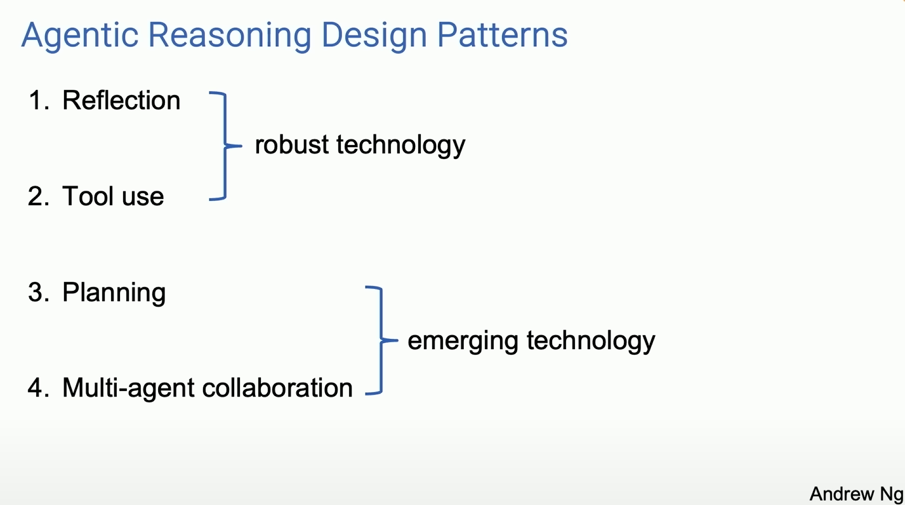

# Hands On: Agentic Reasoning Design Patterns

## What is in this project?
This project is inspired by the recent [video](https://www.youtube.com/watch?v=sal78ACtGTc) from Sequoia Capital, where Andrew Ng discussed four Agentic Reasoning Design Patterns. The goal of this project is to provide a hands-on approach by building simple examples that represent each of the patterns mentioned in the video.

| Pattern | Notebook |
| ------- | -------- |
| Reflection | [01.Reflection.ipynb](https://github.com/jjovalle99/agentic-design-patterns/blob/a1a7e3eab50799b5955d1eb1ec296550b0494c34/01.Reflection.ipynb) |
| Tool use | [02.Tools.ipynb]() |
| Planning | Coming Soon |
| Multi-agent collaboration | Coming Soon |